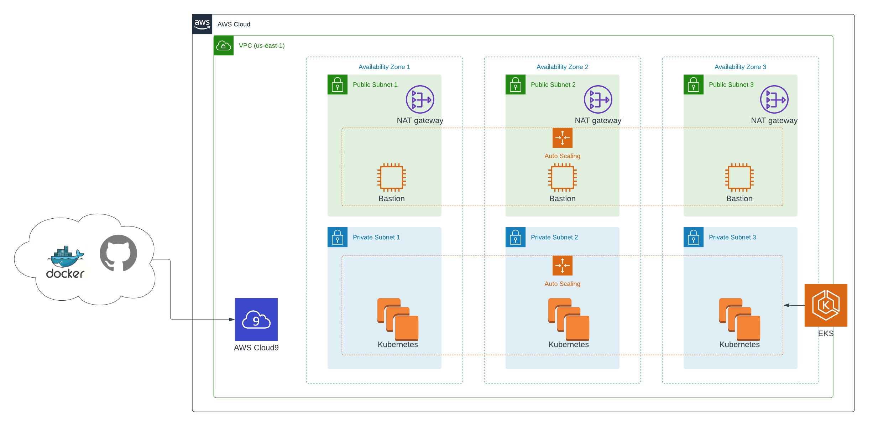

## Operationalizing a House price prediction microservice deployed on AWS

### Introduction

This project involves the operationalization of a House price prediction API. It uses a sklearn model trained to predict housing prices in Boston according to several features, such as average rooms in a home and data about highway access, teacher-to-pupil ratios etc. 
The application has been designed to run in a kubernetes environment to take advantage of auto scaling, improve uptime, stability and availability of the application. Elastic kubernetes service (EKS) on AWS was selected as the ideal platform on which to run, in order to reduce the costs and admin overhead associated with a self hosted Kubernetes cluster.

 

### Project files

| Filename            | Description                                           | 
|---------------------|-------------------------------------------------------|
| app.py              | Main Flask API application                            |                        
| docker_out.txt      | Sample of logs from running docker locally            |
| Dockerfile          | Dockerfile of API                                     |
| kubernetes_out.txt  | Sample logs from running in kubernetes locally        |
| make_prediction.sh  | Sample POST request packet for testing the API        |
| README.md           | README file for the project                           |
| requirements.txt    | Python package Dependencies required to run the API   |
| run_docker.sh       | Script for running and pushing new image to dockerhub |
| run_kubernetes.sh   | Script for running in kubernetes environment          |
| upload_docker.sh    | Script for pushing image to dockerhub                 |

 

### Documentation and design

1. [Architecture](./docs/architecture.md)

2. [CI/CD Pipeline using CircleCI](./docs/circleci.md)

3. [Monitoring and alerting using Prometheus](./docs/prometheus.md)

